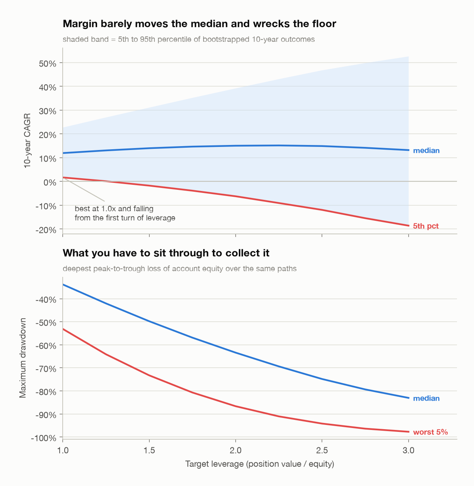
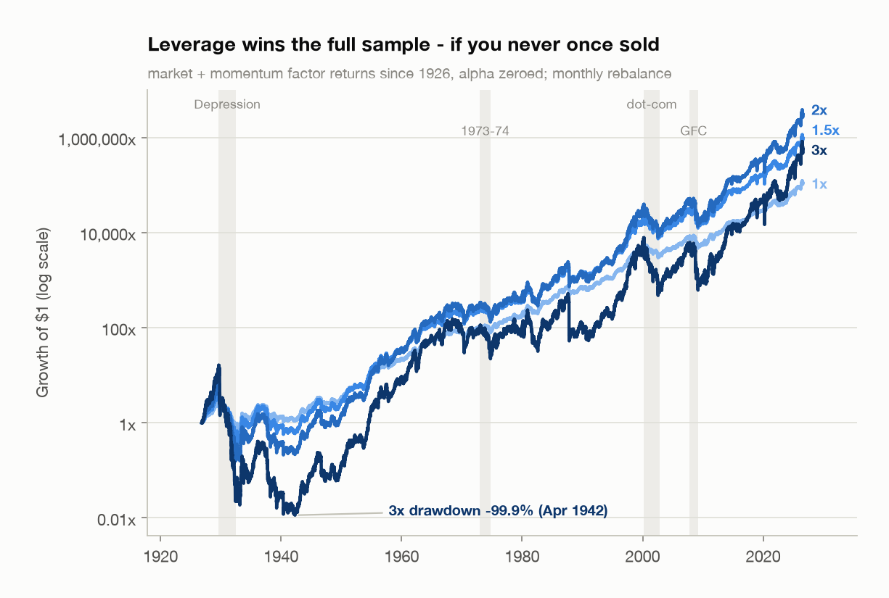
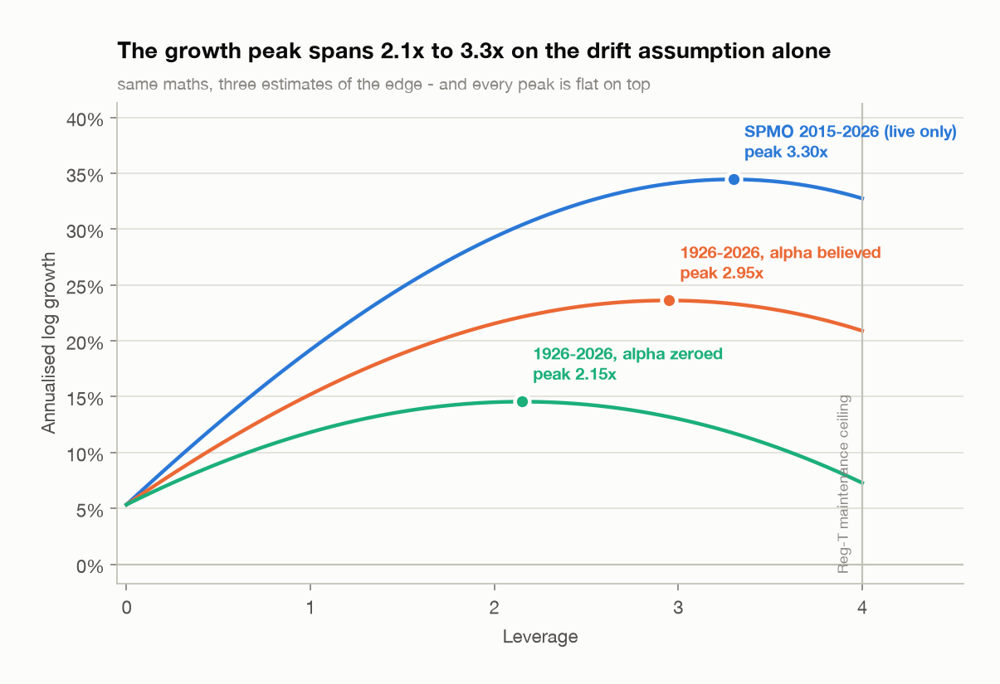
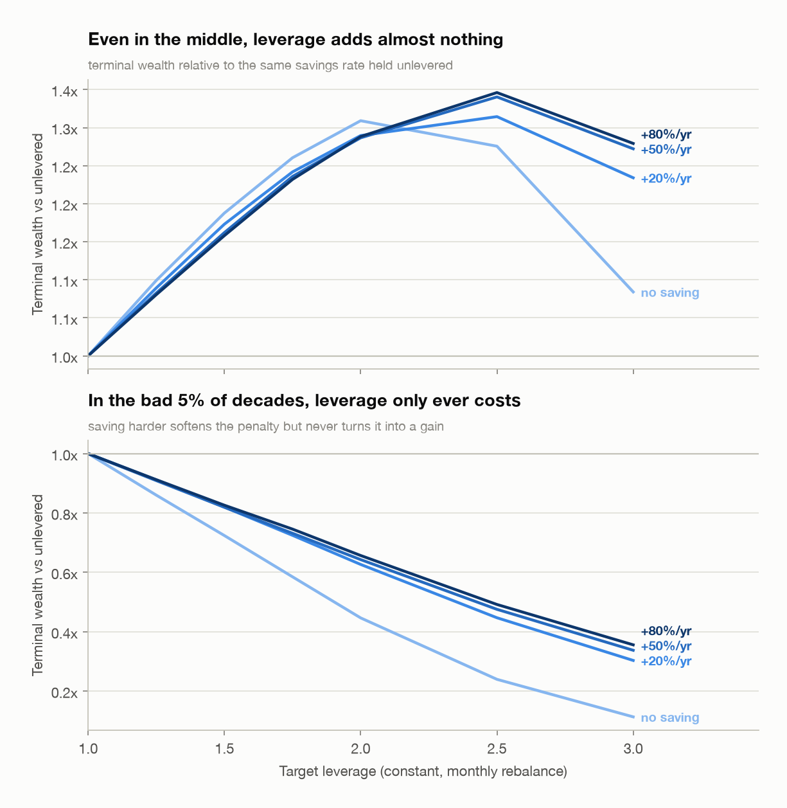

# How much margin is optimal for SPMO?

[SPMO](https://www.invesco.com/us/financial-products/etfs/product-detail?audienceType=Investor&ticker=SPMO)
is the Invesco S&P 500 Momentum ETF. It has returned about 19% a year since launch
with a worst drawdown of only 31%, which makes borrowing against it look extremely
attractive. This repo works out how much you should actually borrow, using IBKR's
real tiered financing cost and a simulation that can margin-call you.

## The answer

**1.0x, and 1.25x is the most any robustness cut supports.**

The number this repo reports has moved twice, in both directions, as errors were
found. That history is in [the audit](#the-overfitting-audit) — the most important
section here, and the one to read before using any of this. What survived every pass
is not a point estimate but a shape: **there is no leverage level at which the bad
outcomes get better.**

On the honest build — real market and momentum factor returns back to 1926, the
fund's own alpha set to zero, idiosyncratic risk restored, financing charged for
calendar days:

| Criterion | Optimal leverage |
|---|---|
| Maximise the 5th percentile of 10-year CAGR | **1.00x** |
| Maximise the 25th percentile | **1.00x** |
| Largest position with median drawdown inside −35% | **1.04x** |
| Half Kelly | **1.08x** (0.83x if momentum's premium is not real) |
| Largest position with median drawdown inside −50% | **1.51x** |
| Full Kelly | **2.15x** |
| Maximise *median* 10-year CAGR | **2.20x** |

The 5th-percentile answer is 1.00x — the floor of the grid — and it stays at 1.00x
across **every** robustness cut tried: four start dates from 1926 to 1990, five
bootstrap block lengths from 5 to 63 days, five bootstrap seeds, the full range of
momentum-premium haircuts, and even with the discredited alpha added back. Nothing
else in this repo is that stable.

The distribution, bootstrapped over 10-year horizons:

| Leverage | 5th pct CAGR | median CAGR | median max drawdown | P(drawdown < −50%) |
|---|---|---|---|---|
| 1.0x | **+1.7%** | 12.0% | −34% | 8% |
| **1.25x** | **+0.1%** | 13.1% | −42% | 26% |
| 1.5x | −1.7% | 14.0% | −50% | 49% |
| 2.0x | −6.2% | 15.0% | −63% | 83% |
| 3.0x | −18.6% | 13.2% | −83% | 100% |

Read it as a price list. Going from 1.0x to 1.25x buys 1.1 points of median CAGR and
costs 1.6 points of 5th-percentile CAGR. Going to 1.5x buys 2.0 and costs 3.4. Going
to 2.0x buys 3.0 and costs 7.9. The trade is never better than roughly fair, and it
gets worse at every step. 1.25x is where it is least bad; 1.0x is where you stop
paying for it at all.

For a concrete position at any of these levels — loan size, the real interest bill,
and the exact price decline that triggers a call — run
`python scripts/position_calculator.py --equity <your equity>`.

## Why not more

Leverage does win the median here, and over the full century it wins outright. The
case against it rests on three things that no amount of risk tolerance fixes.

<picture>
  <source media="(prefers-color-scheme: dark)" srcset="results/figures/growth_vs_downside_dark.png">
  
</picture>

**One: the 5th percentile falls from the very first turn of leverage.** Not from
1.5x, not from 2x — from 1.0x. Every level above unlevered makes a disappointing
decade worse, and by 2x a disappointing decade is −6.2%/yr compounded.

**Two: the drawdowns are not survivable by a person.** Over the century path, max
drawdown is −79% unlevered, −92% at 1.5x, −98% at 2x and −99.9% at 3x. Even in a
typical bootstrapped decade, 1.5x has a coin-flip chance of a −50% drawdown. The
median CAGR at 2x is only available to someone who held a −98% drawdown without
selling, and that person does not exist.

**Three: leverage this size does not bankrupt you, it ruins you.** Because the
account is rebalanced back to target, a fall in equity also cuts the position, which
delevers you automatically. Wiping out needs a single-day gap worse than −1/L — about
−33% at 3x — and the worst day in the sample is −19%, so `prob_ruin` stays near zero
at every level tested. That is not reassurance. A 3x account gets through the century
with a −99.9% drawdown and 117 margin calls. It technically ends ahead of unlevered.
Nobody collects that.

And the one bias the audit could not remove — SPMO was chosen *because* it has done
well — points toward leverage, so the true case is weaker than the tables show.

## The full history, including the parts SPMO missed

SPMO launched in October 2015. Its own record contains no 2008, no 2000–02 and no
1929 — the events that decide whether leverage works. It is also 97% market and 32%
momentum factor, so its history can be rebuilt from real factor returns going back
to 1926 (see [the audit](#the-overfitting-audit) for the regression and why the
intercept is set to zero):

<picture>
  <source media="(prefers-color-scheme: dark)" srcset="results/figures/equity_curves_dark.png">
  
</picture>

Terminal wealth over the century rises to a peak at 2.25x and falls away above it —
so on this single path, leverage up to about 2x genuinely wins. It wins by
surviving a −98% drawdown in the 1930s and 117 margin calls at 3x. The chart is the
strongest case for leverage in this repo and also its own refutation: look at where
the dark line goes between 1930 and 1950, and ask whether the account would still
have been open in 1955 to collect the rest.

What each level kept through the real bear markets, as a fraction of starting equity:

| Episode | 1x | 1.5x | 2x | 2.5x | 3x |
|---|---|---|---|---|---|
| Dot-com bust (2000–02) | 0.65 | 0.46 | 0.32 | 0.21 | **0.12** |
| Global financial crisis (2007–09) | 0.64 | 0.47 | 0.33 | 0.22 | **0.14** |
| Covid crash (2020) | 0.91 | 0.85 | 0.79 | 0.64 | 0.53 |
| 2022 rate shock | 0.90 | 0.82 | 0.75 | 0.68 | 0.61 |

The two sustained bear markets each cut a 2x account by two thirds and a 3x account
by seven eighths. Note how much gentler the two *fast* crashes were at every level:
V-shaped panics are survivable on margin, slow grinds are not, and you do not get to
choose which one you get.

## Kelly is not a number, it is a function of a guess

The Kelly leverage `f* = (mu - r) / sigma**2` is only as good as `mu`, and `mu` is
the hardest quantity in finance to estimate. Volatility you can measure to two
decimal places; drift you cannot measure at all over a human lifetime.

<picture>
  <source media="(prefers-color-scheme: dark)" srcset="results/figures/kelly_growth_dark.png">
  
</picture>

| Sample | mu | sigma | Full Kelly | Half Kelly |
|---|---|---|---|---|
| SPMO's own decade, 2015–2026 | 19.7% | 20.4% | 3.29x | 1.65x |
| 1926–2026, alpha believed | 15.9% | 18.9% | 2.94x | 1.47x |
| **1926–2026, alpha zeroed** | **13.0%** | **18.9%** | **2.15x** | **1.08x** |
| 1926–2026, momentum premium gone too | 11.1% | 18.9% | 1.66x | 0.83x |

The peak moves by a factor of two on the drift assumption alone, and the whole of
that movement is `mu` — sigma barely budges across the rows. Quoting a Kelly number
without the standard error on its drift estimate is meaningless: over 104 years the
standard error on `mu` here is still 1.9%/yr, which puts a 95% interval on full Kelly
of roughly **[0.6x, 2.6x]**. A century of data does not pin down the answer to within
a factor of four.

Two features of the curves argue for halving whatever you compute:

- **The peaks are flat.** Backing off from the peak costs very little growth. Going
  *past* it costs growth *and* adds risk — 1.0x and 2.0x have nearly the same median
  CAGR in the table above, with −34% against −63% median drawdown.
- **The right-hand side is a cliff whose position you do not know.** If the true
  optimum is 1.66x and you sized off SPMO's own decade at 3.29x, you are far past the
  peak, taking much more risk for less growth.

Half Kelly on the honest build is 1.08x, and 0.83x if momentum's premium turns out
not to be real. That is the whole recommendation, arrived at independently of the
5th-percentile argument.

## The overfitting audit

This is the section that changed the answer, and the one to read if you are putting
real money behind any of it.

The first version of this study concluded 1.5x. Three biases were holding that up,
and — as is almost always the case in a backtest — **not one of them pointed in a
random direction.** Every one made leverage look better.

### 1. An in-sample alpha projected across history

SPMO's 4.65%/yr over SPY was measured across the ETF's entire short life, then
applied to decades it never traded through. Regressed properly on the market *and*
the momentum factor over 2015–2026:

| | estimate |
|---|---|
| market beta | 0.969 |
| **momentum beta** | **0.315** |
| alpha | 3.33%/yr |
| standard error on alpha | 2.86%/yr |
| **t-statistic on alpha** | **1.16** |
| R² | 0.789 |

A t-statistic of 1.16 is not evidence of anything; the 95% interval runs from about
−2.3% to +8.9%/yr. An ETF built to track a momentum index earning the momentum
premium is factor exposure, not skill — and factor exposure is exactly the thing
that is priced, crowded, and subject to post-publication decay. The honest build
therefore sets the intercept to zero. `include_alpha=True` prices the alternative.

### 2. Idiosyncratic risk discarded

The SPY beta map had an R² of 0.71, so 29% of SPMO's variance was deleted when
synthesising history. Kelly scales with `1/sigma**2`, so throwing away variance
inflates the answer mechanically. The honest build resamples the regression
residuals back in.

### 3. Financing under-charged by 30%

Interest accrued once per *trading* day on a 360-day basis collects 252/360 of a
year's cost. Real margin interest accrues every calendar day. This one was a plain
bug, worth about 1.5% a year of borrowing cost at 5.13%, and there is now a
regression test pinning it (`test_one_year_of_financing_covers_calendar_days_not_trading_days`).

### Two more errors, pointing the other way

A second audit pass found two mistakes that had been biasing *against* leverage. They
belong here for the same reason the others do — a review that only ever finds
convenient errors is not a review.

**4. The synthetic drift depended on a coin flip.** Resampled residuals are meant to
supply idiosyncratic variance, not drift. But OLS residuals are mean-zero only
in-sample; any single resampled draw has a sample mean worth about 1%/yr of noise at
this length, and that noise landed straight in `mu`, which is the numerator of Kelly.
One unlucky seed was holding `mu` **2.1%/yr below** its correct value. The draw is now
demeaned over exactly the days it is used on, which makes `mu` deterministic — it
equals the factor decomposition to twelve decimal places, and there is a test pinning
that. The decomposition is worth seeing:

| Component | Contribution to mu |
|---|---|
| market (0.969 × market excess) | 6.98%/yr |
| momentum (0.315 × UMD premium) | 2.12%/yr |
| risk-free | 3.11%/yr |
| **total** | **12.95%/yr** |

**5. Pre-1954 financing was overstated by 43%.** Ken French's daily risk-free series
annualises over trading days; it was being scaled by the 360-day interest basis.
Checked against known levels after the fix: 2024 gives 5.0%, 1981 gives 13.6%.

### What each was worth

| Build | Full Kelly | Half Kelly | 5th-pct optimal |
|---|---|---|---|
| as originally shipped | 3.11x | 1.56x | 1.23x |
| + financing charged for calendar days | 2.99x | 1.50x | **1.00x** |
| + in-sample alpha removed | 2.17x | 1.09x | 1.00x |
| + factor-built history back to 1926 | 2.66x | 1.33x | 1.00x |
| **+ idiosyncratic risk restored (honest)** | **2.15x** | **1.08x** | **1.00x** |

Full Kelly fell by a third overall. Note row four *raising* Kelly relative to row
three — that is the residual-risk bias isolated: the factor build alone has a lower
sigma until the idiosyncratic component is put back.

### The question the audit cannot settle

Zeroing the fund's own alpha still leaves the **momentum factor premium** in, worth
2.12%/yr at a 0.315 loading. That premium has a century of evidence behind it, far
more than any single fund's record. It is also the most heavily published anomaly in
finance, and published anomalies decay. So the sweep below keeps momentum's
volatility and crash risk and varies only how much of its *payment* you credit:

| Momentum premium | mu | Full Kelly | Half Kelly | 5th-pct optimal |
|---|---|---|---|---|
| believed in full | 13.0% | 2.15x | 1.08x | **1.00x** |
| halved | 12.1% | 1.91x | 0.95x | **1.00x** |
| gone, risk kept | 11.1% | 1.66x | 0.83x | **1.00x** |

### What is still not tested away

| Robustness check | Range tried | 5th-pct optimal |
|---|---|---|
| start date | 1926, 1946, 1970, 1990 | 1.00x in all four |
| bootstrap block length | 5, 10, 21, 42, 63 days | 1.00x in all five |
| bootstrap seed | five seeds | 1.00x in all five |
| momentum premium haircut | 0% to 100% | 1.00x throughout |
| alpha believed vs zeroed | both | 1.00x in both |
| intraday liquidation modelled | close-only to p95 adverse low | no change below 2.5x |

Full Kelly does move with the start date — 2.15x on the full sample against 2.91x
post-war — so how much of the case rests on 1929 is a fair question to press. But the
5th-percentile answer is 1.00x whichever century you choose, and half Kelly never
exceeds 1.45x under any cut. Reproduce with `python scripts/overfitting_audit.py`.

### The bias that cannot be audited

SPMO was chosen for this study *because it has done well*. Nobody runs this analysis
on a momentum ETF that disappointed, because nobody thinks to lever one of those. No
amount of care inside the model corrects for selection on the dependent variable at
the moment the ticker was picked — it can only be named, as it is here, and it points
toward leverage.

## Financing cost is modelled properly, and it matters

IBKR quotes margin loans as *benchmark + spread*, blended across tiers, accrued daily
on a 360-day year. The first $100k of any loan is always charged at the most
expensive tier, so retail-sized borrowers pay near the top rate.

At today's benchmark (Fed Funds effective, **3.63%**):

| Loan size | Blended annual rate |
|---|---|
| $25,000 | 5.13% |
| $100,000 | 5.13% |
| $250,000 | 4.83% |
| $1,000,000 | 4.68% |

**On the account-region question:** it mostly does not matter. A USD loan against a
US-listed ETF is priced off the USD benchmark whether the account is booked in
Australia, Hong Kong or the US. What changes between IBKR entities is which currency
you can borrow and the Pro/Lite tier — IBKR Lite pays benchmark + 2.5% flat, a full
point worse than Pro's first tier. Check `results/ibkr_rate_table.csv` and set
`benchmark_override` if your statement disagrees.

The rate level changes the conclusion more than the region does. Rerunning the
bootstrap at a 6% benchmark (7.5% financing at retail size):

| Leverage | 5th pct CAGR @ 3.63% | 5th pct CAGR @ 6% |
|---|---|---|
| 1.0x | 6.1% | 6.1% |
| 1.5x | 6.0% | 5.2% |
| 2.0x | 5.1% | 3.3% |
| 2.5x | 2.5% | −0.1% |
| 3.0x | −0.9% | −4.2% |

At a 6% benchmark the robust-optimal leverage is **1.0x** — the momentum edge no
longer covers the borrowing cost on a bad path. Financing above roughly 7% removes
the case for margin here entirely.

**Deductibility cuts the other way, and by a similar amount.** Where margin interest
is deductible against other taxable income, the real cost of a 5.13% loan at a 37%
marginal rate is about 3.2%, which shifts the answer up as decisively as a rate rise
shifts it down. `Account(interest_tax_shield=0.37)` models this as a reduced effective
rate. Two warnings on using it: it assumes the deduction is usable in the year it
accrues, and it must be left at **zero** wherever the income being financed is itself
tax-exempt — you cannot deduct the cost of earning exempt income, so a regime that
exempts the gains also removes the shield. Which of those applies is a question for
an accountant in the relevant jurisdiction, not for a backtest; the parameter exists
so both branches can be priced rather than assumed.

## Does an account you keep funding want more leverage?

The intuition says yes: new cash every month can meet a margin call, so you can
afford to run hotter. **The intuition is wrong**, and it is wrong for a reason worth
internalising — under constant-leverage rebalancing, *new cash does not buffer the
position, it joins it.* Every dollar you deposit gets levered to the same target on
the next rebalance, so funding the account buys exposure, not safety.

<picture>
  <source media="(prefers-color-scheme: dark)" srcset="results/figures/leverage_vs_saving_dark.png">
  
</picture>

Terminal wealth after 10 years, each row indexed to its own unlevered outcome, so
the rows compare the *shape* of the leverage response rather than account size:

| Savings rate | | 1.0x | 1.5x | 2.0x | 2.5x | 3.0x |
|---|---|---|---|---|---|---|
| none | median | 1.00 | 1.19 | 1.31 | 1.28 | 1.08 |
| none | **5th pct** | 1.00 | 0.72 | 0.45 | 0.24 | **0.11** |
| +50%/yr | median | 1.00 | 1.16 | 1.29 | 1.34 | 1.27 |
| +50%/yr | **5th pct** | 1.00 | 0.82 | 0.64 | 0.48 | **0.34** |

Read the 5th-percentile rows: **every entry is below 1.00, at every savings rate.**
There is no contribution level at which leverage improves the bad outcome. Saving
harder softens the penalty (0.11 → 0.34 at 3x) because deposits dilute the damage
done to the early balance, but it never converts the penalty into a gain — and the
softening is the *only* thing contributions do here.

Meanwhile the savings rate moves outcomes by multiples rather than fractions, and it
is the only lever here that improves both tails at once.

### The fixed-dollar-loan strategy is not the free lunch it looks like

A tempting alternative: borrow a fixed number of dollars once and never top it up, so
contributions and growth dilute the loan and leverage decays toward 1x. At first
glance it dominates — 3.0x initial gives a 5.1% 5th-percentile CAGR against −2.2% for
constant 3.0x, with a 34% chance of a −50% drawdown against 96%.

It is an artefact of measuring the wrong thing. Tracking what leverage was actually
*held*, "3.0x initial" under a fixed loan averages **1.57x** and ends at 1.20x. Once
matched on average leverage the advantage evaporates:

| Strategy | Initial | Mean held | 5th pct CAGR | P(drawdown < −50%) |
|---|---|---|---|---|
| constant leverage | 1.25x | 1.25x | +0.2% | 27% |
| fixed dollar loan | 1.75x | 1.24x | +0.0% | 30% |
| constant leverage | 1.5x | 1.50x | −1.4% | 50% |
| fixed dollar loan | 2.5x | 1.46x | −2.4% | 50% |

At matched average leverage the two are within noise, and the fixed loan is if
anything slightly worse — it concentrates its risk early, when the loan is large
relative to the account. The funding strategy does not create anything; it only
changes your effective average leverage. Choose the average you want and pick
whichever mechanism gets you there.

Reproduce with `python scripts/funding_strategies.py`.

## How the account is modelled

Not as a leveraged ETF. The simulation holds a position `P`, a debit balance `D`
accruing tiered interest, and equity `E = P - D`, and steps day by day:

1. Interest accrues on yesterday's debit balance at the blended tiered rate.
2. The market moves the position.
3. If `E/P` falls below the 25% maintenance requirement, the position is force-sold
   down to the requirement with 10bp of slippage. This is a real, permanent loss.
4. On the rebalance schedule, the position is reset to target leverage.

Leverage therefore *drifts upward during a drawdown* between rebalances, exactly as
it does in a real account, rather than being magically constant.

### Rebalancing to target, or borrowing once and leaving it

Frequency among the active schedules barely matters (`results/rebalance_schedules.csv`).
Whether you rebalance *at all* matters enormously, and the answer is: **rebalance to
target.**

A static loan lets leverage *ratchet up* through a decline — equity falls, the debt
does not, so exposure grows exactly when it should shrink. Rebalancing sells into the
fall and delevers you automatically. Equity left at the bottom, 2.0x target:

| | dot-com 2000–02 | GFC 2007–09 |
|---|---|---|
| rebalanced to target | 0.38 | **0.25** |
| borrowed once, left alone | 0.26 | **0.11** |

The bootstrap agrees, and does so even after handicapping the comparison in the
static loan's favour. At a 2.0x target a static loan holds a *mean* leverage of only
1.77x, against a constant 2.00x when rebalanced — and still returns a worse
5th-percentile CAGR (−16.0% against −5.5% for constant 1.5x) and a worse drawdown
probability. Over the full century the static 2.0x holds a mean leverage of 1.19x and
still compounds at 9.0% against 10.2% for a constantly-rebalanced 2.0x.

Rebalancing does pay a real volatility drag of roughly `L(L-1)σ²/2` — mechanically
selling low and buying high — but being deleveraged automatically in a sustained
decline is worth far more than the drag costs.

**A note on how this conclusion moved.** On the earlier, biased build the bootstrap
favoured the static loan while the historical bear markets favoured rebalancing, and
an earlier version of this README spent a section explaining that disagreement as a
block-bootstrap artefact — 21-day blocks cannot reproduce a two-year grind down.
That reasoning about block bootstraps is still true in general, but it was not what
was happening here: once the alpha came out and the idiosyncratic risk went back in,
the fatter left tail made the ratchet effect dominate and the disagreement vanished.
A spurious methodological puzzle was a symptom of the biases, not a finding.

## Reproducing

```bash
python -m venv .venv && source .venv/bin/activate
pip install -e ".[dev]"
python scripts/run_analysis.py          # the main study
python scripts/overfitting_audit.py     # what each bias was worth -- read this one
python scripts/funding_strategies.py    # contributions and funding strategy
python scripts/position_calculator.py --equity 50000   # a concrete position
pytest                                  # 89 tests
```

Data comes from Yahoo Finance (SPMO, SPY total return), FRED (`DFF`, the Fed Funds
effective rate IBKR benchmarks against) and Ken French's data library (daily market,
risk-free and momentum factors back to 1926), cached to `data/` so a rerun is
deterministic. `--refresh` re-downloads.

The test suite is worth a glance: it checks the tiered rate blending against
hand-computed values, checks that an unlevered account reproduces the raw return
exactly, checks that a flat market at 2x costs precisely one unit of compounded
financing, checks that deposits are never counted as returns (a flat market with
contributions must report exactly 0% time-weighted), and checks the fast vectorised
bootstrap simulator against the readable day-by-day one across 72
leverage/schedule/funding/intraday combinations, pins the calendar-day financing
accrual, and pins the invariant that the synthetic drift cannot depend on which
residual draw came up. That last test is what caught a missing
credit-interest branch in the vectorised twin, which only became reachable once
contributions could push the balance from debit into cash.

### Layout

| Path | What it holds |
|---|---|
| `spmo_margin/margin.py` | IBKR tiered rates, credit interest, calendar-day accrual |
| `spmo_margin/backtest.py` | day-by-day account with forced liquidation and funding |
| `spmo_margin/metrics.py` | time- and money-weighted returns, drawdown, pain vs contributed |
| `spmo_margin/bootstrap.py` | vectorised twin + moving-block resampling |
| `spmo_margin/kelly.py` | Gaussian and empirical log-growth optimum |
| `spmo_margin/optimal.py` | the several meanings of "optimal" |
| `spmo_margin/data.py` | prices, Fed Funds, Fama-French factors, history reconstruction |
| `scripts/overfitting_audit.py` | the bias audit and every sensitivity sweep |
| `scripts/position_calculator.py` | loan, interest bill and margin-call distance |
| `results/` | every table as CSV, `key_facts.json`, charts |

## What would change the answer

Honest limitations, roughly in order of how much they should worry you:

- **SPMO was selected because it has done well.** Nothing inside the model fixes
  selection on the dependent variable at the point the ticker was chosen. This is
  the largest un-auditable bias here and it points toward leverage.
- **90% of the history is synthetic.** It is a two-factor reconstruction with
  resampled residuals, not SPMO. The factor loadings are themselves estimated over
  a single decade, and there is no mechanism for momentum to break down in a way
  the 1926–2015 factor record never showed.
- **The regime is not constant.** 1929–32 had no circuit breakers, no deposit
  insurance and 10% initial margin requirements. Including it is what pulls full
  Kelly from 2.91x to 2.15x, so a reader who thinks that era is uninformative should
  read the post-war row of the sensitivity table instead — the 5th-percentile answer
  is 1.00x either way.
- **Factor loadings are assumed constant and are not.** Over 250-day rolling windows
  SPMO's momentum beta ranges from −0.01 to 0.61 and its market beta from 0.03 to
  1.20. The whole century is reconstructed from single full-sample loadings of 0.969
  and 0.315, which is a strong assumption doing a lot of work.
- **Dividend withholding is not modelled.** Total returns here assume full dividend
  reinvestment. A non-US holder loses 15% of distributions under a treaty and 30%
  without one, which is a permanent drag of roughly 15–30bp/yr on a ~1% yield.
- **Daily closes hide intraday risk.** Margin calls are evaluated on closing prices.
  A real broker liquidates on intraday lows, so margin-call counts here are floors.
- **Block bootstrap cannot invent a worse crash than the sample contains,** and it
  cannot reproduce a slow one. 21-day blocks destroy multi-year persistence, so no
  resampled decade contains a two-year grind down. It reshuffles history, it does not
  extend it, so every historical-episode table here is doing work the resampling
  cannot.
- **No taxes, no commissions, no dividend withholding, no tracking error, no
  bid-ask.** Forced-liquidation slippage is the only transaction cost modelled, and
  every omission flatters the levered case.
- **Financing is priced off today's tier schedule.** IBKR can change spreads without
  notice, and a levered position has no way to refuse.

## Not investment advice

This is a personal quantitative study of a public ETF, not a recommendation. The
central finding is a caution, not a strategy: the leverage that maximises expected
growth is far higher than the leverage a person can actually hold, and the gap
between them is where leveraged accounts die.
